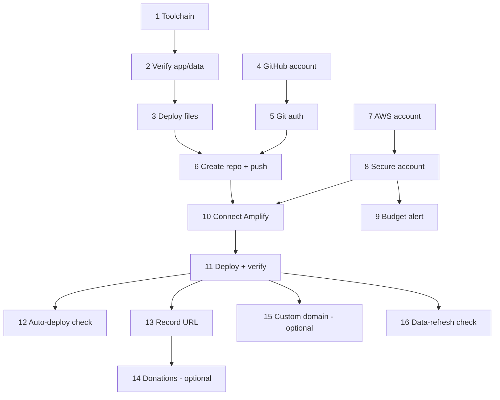

# Implementation Plan: Deploy MFM Tool to AWS

## Overview

Publish the static MFM tool to a public Amplify URL, starting with no GitHub or
AWS account. Open `mfm-tool/` as the workspace and read
`.kiro/steering/deploy.md` and `.kiro/steering/mfm-tool.md` first.

Task tags: **[manual]** = owner does it in a browser (agent guides);
**[agent]** = agent can run/edit directly. Complete manual account steps before
the steps that depend on them.

## Tasks

### Phase 0 — Verify locally

- [ ] 1. Confirm toolchain and dependencies **[agent]**
  - Check `git --version`, `python3 --version`, `pip --version`.
  - `pip install -r requirements.txt`.
  - _Requirements: 1.1_

- [ ] 2. Verify the app runs and data is current **[agent]**
  - Ensure `web/data.js` exists; if missing/stale, regenerate:
    `PYTHONPATH=src python -m mfm.cli build-app --diff data/diff.json --new data/new.json`.
  - Serve and smoke-test: `python3 -m http.server -d web 8000` → open
    `http://localhost:8000`; confirm all three tabs render and a list builds.
  - _Requirements: 1.2, 1.3_

- [ ] 3. Confirm deploy files exist **[agent]**
  - Verify `.gitignore` (excludes `data/raw/`, keeps `web/data.js`) and
    `amplify.yml` (publishes `web/`) are present.
  - _Requirements: 2.3, 4.1_

### Phase 1 — GitHub

- [ ] 4. Create and secure a GitHub account **[manual]**
  - Sign up at github.com; enable 2FA/MFA.
  - _Requirements: 2.1_

- [ ] 5. Configure git + authentication **[manual]** (agent guides)
  - `git config --global user.name`/`user.email`.
  - Authenticate: `gh auth login` (or add an SSH key, or create an HTTPS PAT).
  - _Requirements: 2.2_

- [ ] 6. Create the repo and push **[agent]** (owner creates the empty GitHub repo)
  - Owner creates an empty repo (no README) on GitHub.
  - From `mfm-tool/`: `git init`, `git add .`, commit, `git branch -M main`,
    `git remote add origin <url>`, `git push -u origin main`.
  - Confirm `web/data.js` and `data/*.json` are pushed; `data/raw/` is not.
  - _Requirements: 2.3_

### Phase 2 — AWS account (safety first)

- [ ] 7. Create the AWS account **[manual]**
  - Sign up at aws.amazon.com (requires payment method); verify email/phone.
  - _Requirements: 3.1_

- [ ] 8. Secure the account **[manual]**
  - Enable MFA on the root user; stop using root afterward.
  - Create an IAM Identity Center (or IAM) admin/least-privilege user for daily
    use; sign in as that user.
  - _Requirements: 3.1, 3.2_

- [ ] 9. Add a cost guardrail **[manual]**
  - AWS Budgets → create a monthly cost budget (e.g. $1–$5) with an email alert.
  - _Requirements: 3.3_

### Phase 3 — Deploy on Amplify

- [ ] 10. Connect the repo to Amplify **[manual]** (agent guides)
  - AWS Console → Amplify → New app → Host web app → GitHub → authorize →
    select the repo and `main` branch.
  - Confirm Amplify detects `amplify.yml` (no build; publishes `web/`); if asked
    for an app root, point it at `web/`.
  - _Requirements: 4.1_

- [ ] 11. Deploy and verify live **[manual]** (agent guides verification)
  - Run the deployment; wait for success.
  - Open the `https://<id>.amplifyapp.com` URL on a clean browser/device;
    confirm HTTPS, all three tabs, and that a sample list builds + saves.
  - _Requirements: 4.2_

- [ ] 12. Confirm auto-deploy **[agent]**
  - Make a trivial commit (e.g. README tweak) and push; confirm Amplify
    redeploys automatically.
  - _Requirements: 4.3_

### Phase 4 — Finishing touches

- [ ] 13. Record the live URL **[agent]**
  - Put the Amplify URL in `README.md` (Live demo line); commit and push.
  - _Requirements: 5.1_

- [ ] 14. (Optional) Enable donations **[agent]**
  - Set the `#donate` link `href` in `web/index.html` to a Ko-fi / Buy Me a
    Coffee / GitHub Sponsors URL and remove its `hidden` attribute; push.
  - _Requirements: 5.2_

- [ ] 15. (Optional) Custom domain **[manual]**
  - Amplify → Domain management → add a domain (Route 53 ~$0.50/mo + ~$12/yr).
  - _Requirements: 4.2_

- [ ] 16. Confirm the data-refresh flow **[agent]**
  - Verify the documented update path works end-to-end: re-run `ingest-new` →
    `compare` → `build-app`, commit, push, and confirm the live site updates.
  - _Requirements: 5.3_

## Task Dependency Graph



Parallel execution waves (tasks in a wave can run together; later waves depend
on earlier ones):

```json
{
  "waves": [
    { "wave": 1, "tasks": ["1", "4", "7"], "description": "Independent starts: toolchain, GitHub account, AWS account" },
    { "wave": 2, "tasks": ["2", "5", "8"], "description": "Verify app/data; git auth; secure AWS account" },
    { "wave": 3, "tasks": ["3", "9"], "description": "Confirm deploy files; AWS budget alert" },
    { "wave": 4, "tasks": ["6"], "description": "Create repo and push" },
    { "wave": 5, "tasks": ["10"], "description": "Connect repo to Amplify" },
    { "wave": 6, "tasks": ["11"], "description": "Deploy and verify live" },
    { "wave": 7, "tasks": ["12", "13", "15", "16"], "description": "Auto-deploy check, record URL, optional domain, data-refresh check" },
    { "wave": 8, "tasks": ["14"], "description": "Optional donations" }
  ]
}
```

## Notes

- Phases 1 (GitHub) and 2 (AWS) are independent and can be done in parallel;
  both must finish before Phase 3 (task 10).
- Tasks 14 and 15 are optional and can be skipped or deferred.
- No application code changes are required; this plan is operational.
- Account-creation tasks ([manual]) cannot be performed by the agent — it
  guides and then runs the CLI/file steps that follow.
